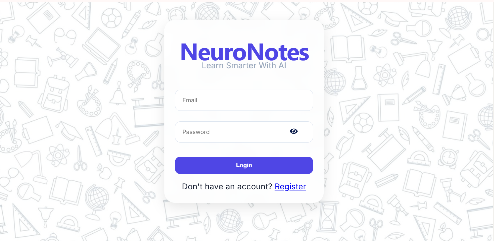
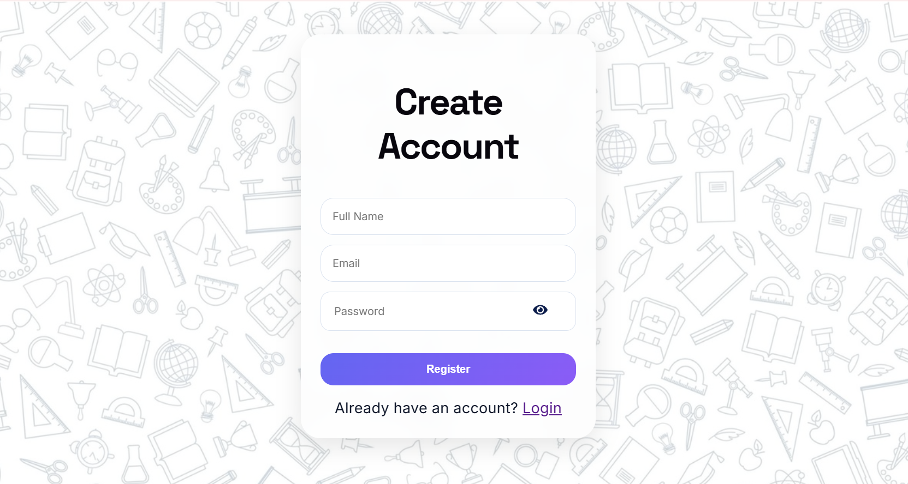
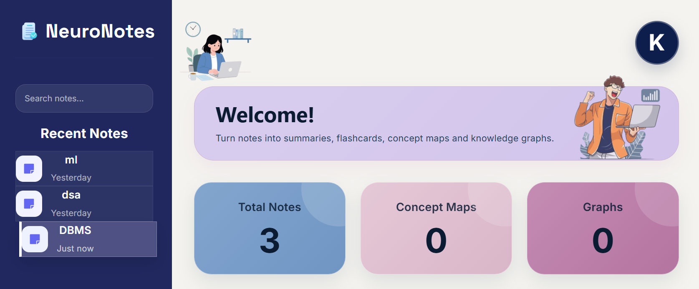
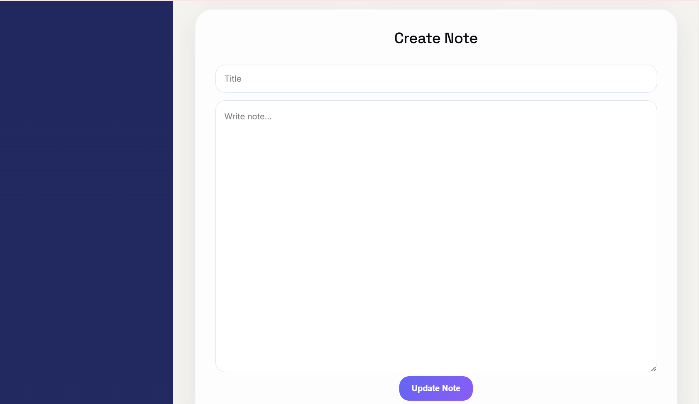
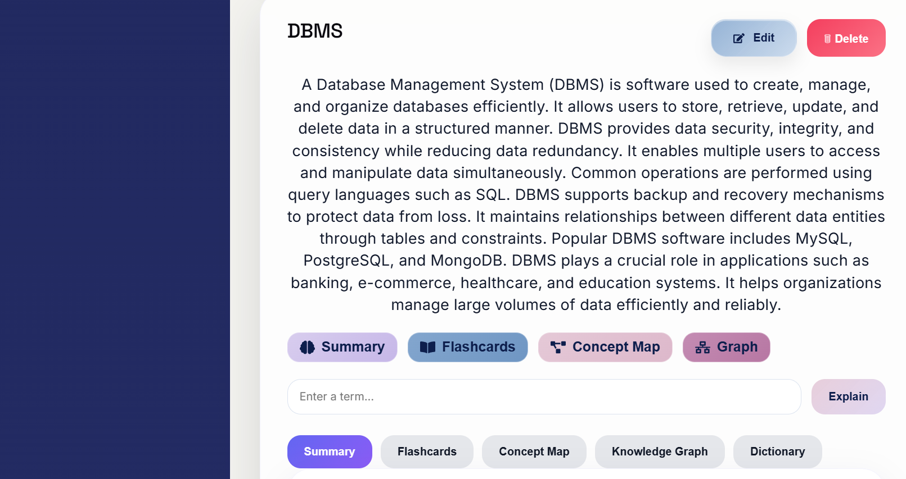
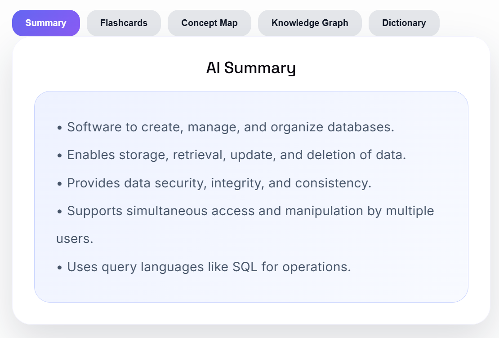
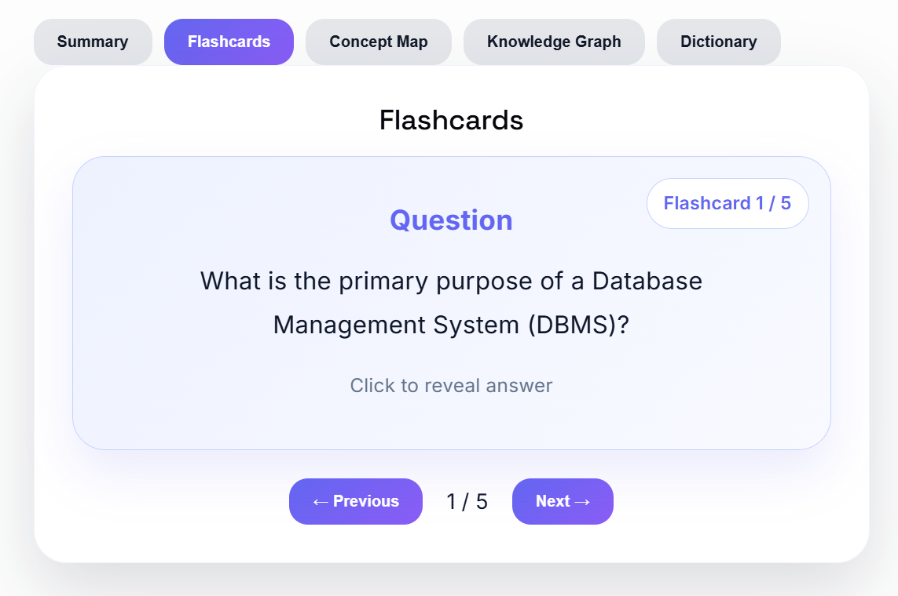
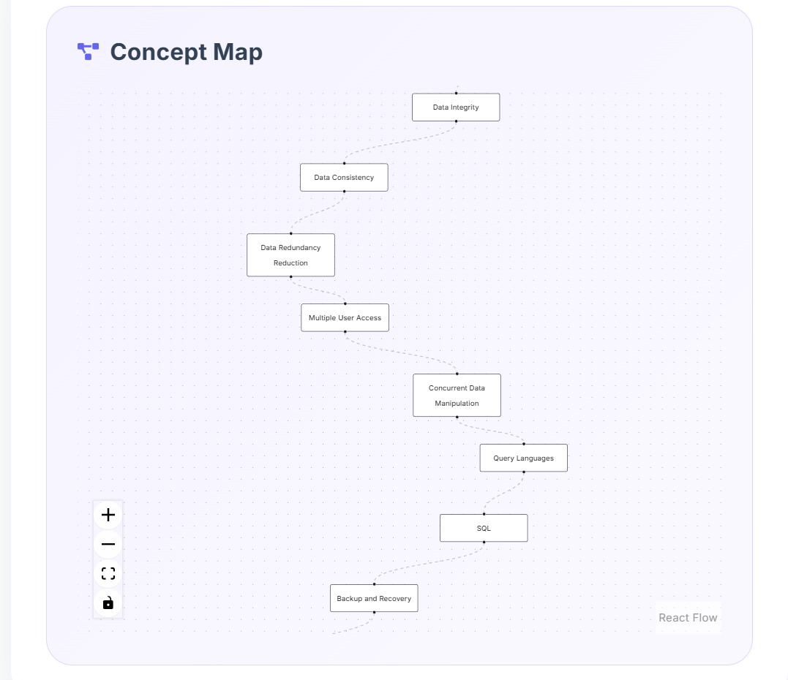
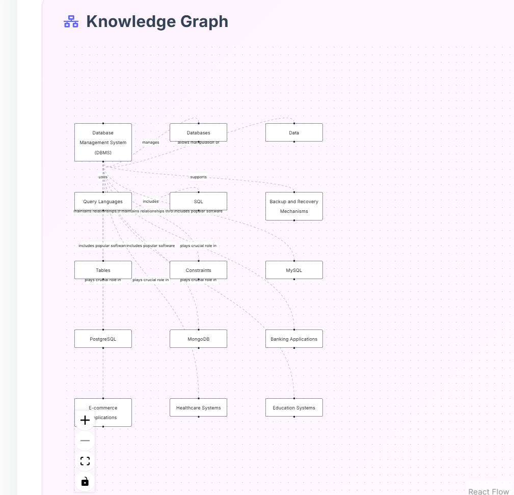
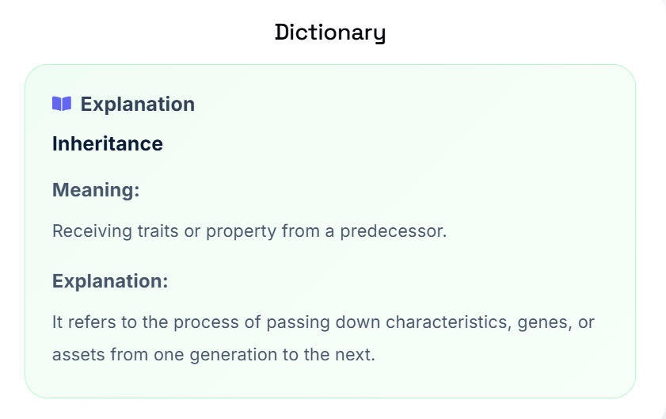

# 🧠 NeuroNotes

AI-Augmented Note-Taking & Knowledge Visualization Platform built with the MERN Stack and Gemini AI.

NeuroNotes helps students transform traditional notes into intelligent learning resources such as summaries, flashcards, concept maps, knowledge graphs, and dictionary explanations.

---

## 🚀 Live Demo

Frontend: https://neuro-notes-psi.vercel.app

Backend: https://neuronotes-backend-afri.onrender.com

---

## ✨ Features

### Authentication

- User Registration
- Secure Login
- JWT Authentication
- Protected Routes
- User Profile Dropdown

### Smart Notes

- Create Notes
- Edit Notes
- Delete Notes
- Recent Notes Sidebar
- Relative Time Updates

### AI-Powered Learning

- AI Note Summarization
- Flashcard Generation
- Concept Map Creation
- Knowledge Graph Generation
- Dictionary & Term Explanation

### User Experience

- Responsive Design
- Mobile Friendly Interface
- Modern Dashboard
- Password Visibility Toggle
- Interactive UI Components

---

## 🛠️ Tech Stack

### Frontend

- React.js
- Vite
- Axios
- React Icons
- CSS3

### Backend

- Node.js
- Express.js
- JWT Authentication
- bcryptjs

### Database

- MongoDB Atlas
- Mongoose

### AI

- Google Gemini API

### Deployment

- Vercel
- Render

---

## 📂 Project Structure

```bash
NeuroNotes
│
├── frontend
│   ├── src
│   ├── assets
│   └── components
│
├── backend
│   ├── controllers
│   ├── routes
│   ├── middleware
│   ├── models
│   └── config
│
└── README.md
```

---

## 🔥 Core Functionalities

### AI Summary

Converts lengthy notes into concise summaries.

### Flashcards

Generates question-answer style flashcards for revision.

### Concept Maps

Extracts key concepts and relationships from notes.

### Knowledge Graphs

Visualizes connections between important entities.

### Dictionary

Provides instant explanations for technical terms.

---

## 📸 Screenshots

## 📸 Project Screenshots

### Login Page



### Register Page



### Dashboard





### AI Summary



### Flashcards



### Concept Map



### Knowledge Graph



### Dictionary



Example:

- Login Page
- Register Page
- Dashboard
- AI Summary
- Flashcards
- Concept Map
- Knowledge Graph

---

## ⚙️ Installation

### Clone Repository

```bash
git clone https://github.com/devkajals41/neuroNotes.git
```

### Backend Setup

```bash
cd backend
npm install
```

Create a `.env` file:

```env
PORT=5000
MONGO_URI=YOUR_MONGO_URI
JWT_SECRET=YOUR_SECRET
GEMINI_API_KEY=YOUR_API_KEY
```

Run Backend:

```bash
npm run dev
```

### Frontend Setup

```bash
cd frontend
npm install
npm run dev
```

---

## 📈 Future Improvements

- PDF Upload Support
- RAG-Based Document Retrieval
- AI Quiz Generation
- Dark Mode
- Note Sharing
- Export Notes as PDF

---

## 👨‍💻 Author

Kajal

B.Tech Electronics & Communication Engineering  
NIT Jalandhar

GitHub: https://github.com/devkajals41

---

## ⭐ Support

If you found this project useful, consider giving it a star.
